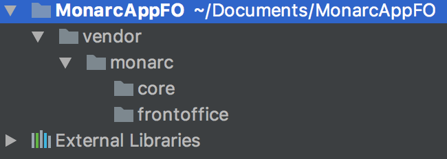
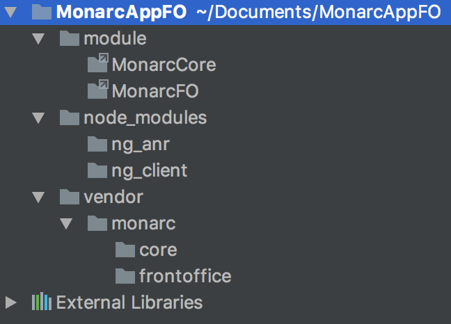

Installation on Ubuntu 17.04
============================

The master branch should always be working and it is recommended to install the
project using this one.

If you have already installed MONARC and want to upgrade to a later version, you
can use the provided script:

    $ scripts/update-all.sh
    $ sudo systemctl restart apache2

PHP & MySQL
-----------

Install PHP (version 7.0 recommended) with extensions : *xml*, *mbstring*,
*mysql*, *zip*, *unzip*, *mcrypt*, *intl*, *gettext* and *imagick*.

In __php.ini__, set:

* *upload_max_filesize* to 200M;
* *post_max_size* to 50M;
* *memory_limit* to 512M (snapshots of important risk analysis requires more
  memory).

Install Apache and enable mods: *rewrite*, *ssl* (with a2enmod)

Install MariaDB.

Installation of MONARC
----------------------

Clone the repository and invoke `composer` using the shipped `composer.phar`:

    git clone https://github.com/monarc-project/MonarcAppFO.git ./monarc   
    cd monarc/
    chown -R www-data data
    chmod -R g+w data
    php composer.phar self-update
    php composer.phar install -o

(The `self-update` directive is to ensure you have an up-to-date `composer.phar`
available.)

Databases
---------
Create 2 databases:

    CREATE DATABASE monarc_cli DEFAULT CHARACTER SET utf8 DEFAULT COLLATE utf8_general_ci;
    CREATE DATABASE monarc_common DEFAULT CHARACTER SET utf8 DEFAULT COLLATE utf8_general_ci;

Change SQL Mode in my.cnf:

    [mysqld]
    sql-mode = MYSQL40

There are 2 databases:
* monarc_common contains models and data created by CASES;
* monarc_cli contains all client risk analyses. Each analysis is based on CASES
  model of monarc_common.

API
---

The project is composed of 2 parts:

* an API in charge of retrieving data;
* an interface which displays data.

The API is not directly modules of the project but libraries.
You must create modules with symbolic links to libraries.
Create 2 symbolic links in the root of project directory:

    mkdir module
    cd module/
    ln -s ./../vendor/monarc/core MonarcCore
    ln -s ./../vendor/monarc/frontoffice MonarcFO

There are 2 parts:
* one only for front office;
* one common for front office and back office (private project).

It is developed with Zend framework 2.

Interfaces
----------

Repository for Angular at the root of the project:

    mkdir node_modules
    cd node_modules
    git clone https://github.com/monarc-project/ng-client.git ng_client
    git clone https://github.com/monarc-project/ng-anr.git ng_anr    

There are 2 parts:
* one only for front office: ng_client;
* one common for front office and back office: ng_anr.

It is developed with Angular framework version 1.

Web Server Setup
----------------

### PHP CLI Server

The simplest way to get started if you are using PHP 5.4 or above is to start
the internal PHP cli-server in the root directory:

    php -S 0.0.0.0:8080 -t public/ public/index.php

This will start the cli-server on port 8080, and bind it to all network
interfaces.

Note: The built-in CLI server is **for development only**.

### Apache Setup

To setup Apache, setup a virtual host to point to the public/ directory of the
project and you should be ready to go! It should look something like below:

    <VirtualHost 127.0.0.1:80>
        ServerName monarc.localhost
        DocumentRoot /path/to/monarc/public
        SetEnv APPLICATION_ENV "development"
        <Directory /path/to/monarc/public>
            DirectoryIndex index.php
            AllowOverride All
            Require all granted
        </Directory>
    </VirtualHost>

Database connection
-------------------

Create file `config/autoload/local.php`:

    return array(
        'doctrine' => array(
            'connection' => array(
                'orm_default' => array(
                    'params' => array(
                        'host' => 'host',
                        'user' => 'user',
                        'password' => 'password',
                        'dbname' => 'monarc_common',
                    ),
                ),
                'orm_cli' => array(
                    'params' => array(
                        'host' => 'host',
                        'user' => 'user',
                        'password' => 'password',
                        'dbname' => 'monarc_cli',
                    ),
                ),
            ),
        ),
    );

Configuration
-------------

Create configuration file

    sudo cp ./config/autoload/local.php.dist ./config/autoload/local.php

Update connection information to *local.php* and *global.php*.

Configuration files are stored in cache.
If your changes have not been considered, empty cache by deleting file in
/data/cache

Install Grunt
-------------

    sudo apt-get install nodejs
    sudo apt-get install npm
    sudo npm install -g grunt-cli
    sudo ln -s /usr/bin/nodejs /usr/bin/node

Update project
--------------
Play script (mandatory from the root of the project):

    /bin/bash ./scripts/update-all.sh

This script will retrieve the updates from the last stable release of MONARC.

It uses others shell scripts. You may need to change the access rights of those
scripts.

Before updating MONARC it is advised to configure database backup. For that you
just need to create a file _data/backup/credentialsmysql.cnf_:

    [client]
    host     = localhost
    user     = sql-monarc-user
    password = your-password
    socket   = /var/run/mysqld/mysqld.sock
    [mysql_upgrade]
    host     = localhost
    user     = sql-monarc-user
    password = your-password
    socket   = /var/run/mysqld/mysqld.sock
    basedir  = /usr

If this file is not present, a warning message will be displayed during the
backup.

Create Initial User and Client
------------------------------

Modify email and password (firstname or lastname) of first user in
./module/MonarcFO/migrations/seeds/AdminUserInit.php

If you have a mail server, you can keep default password and click on
"Password forgotten ?" after user creation.

Create first user:

    php ./vendor/robmorgan/phinx/bin/phinx seed:run -c ./module/MonarcFO/migrations/phinx.php
