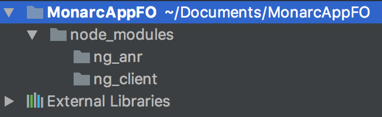
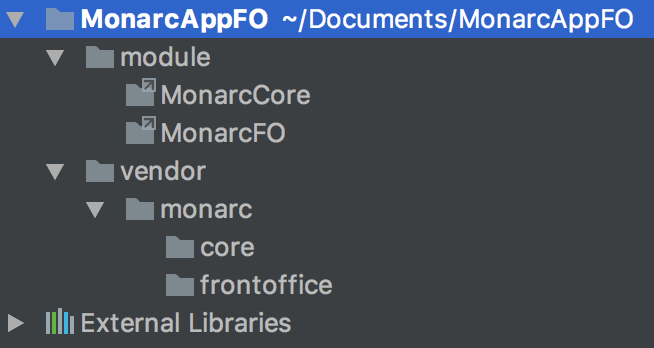

Skeleton Monarc Project
=======================

*Disclaimer: This is a work in progress and software is still in alpha stage.*

Introduction
------------
Skeleton Monarc Project.

Installation
------------

PHP & MySQL
-----------
Install PHP (version 7.0 recommended) with Apache (or Nginx) with extensions : xml, mbstring, mysql, zip, unzip, mcrypt, intl, imagick (extension php)
For Apache add mods : rewrite, ssl (a2enmod)
  
Install MySQL (version 5.7 recommended) or MariaDb equivalent
       
       
Using Composer (recommended)
----------------------------

Alternately, clone the repository and manually invoke `composer` using the shipped
`composer.phar`:

    cd my/project/dir
    git clone ssh://github.com/CASES-LU/MonarcAppFO.git ./monarc   
    cd monarc
    php composer.phar self-update
    php composer.phar install -o (modifier le package.json deux errreurs passer en dev-beta le core et il y a un / en trop pour zm-core)

(The `self-update` directive is to ensure you have an up-to-date `composer.phar`
available.)

Databases
---------
Create 2 databases: 

    CREATE DATABASE monarc_cli;
    CREATE DATABASE monarc_common;
    
Change Sql Mode in my.cnf:

    sql-mode = MYSQL40
    
There is 2 databases: 
* monarc_common contain models and data create by smile.
* monarc_cli contain all client risks analyses. Each analysis is based on Smile model of monarc_common

Symbolics links
---------------

The project is splited on 2 parts :
* an Api in charge of retrieve data
* an interface to display data

The Api is not direct modules of the project but libraries.
You must create modules with symbolics link to libraries

Create 2 symbolics links at project root: 

    mkdir module
    cd module
    ln -s ./../vendor/monarc/core MonarcCore;
    ln -s ./../vendor/monarc/frontoffice MonarcFO;
    
There is 2 parts:
* one only for front office
* one common for front office and back office (private project)

It is develop with zend framework 2
    

    
Interfaces
----------
Repository for angular  at project root:

    mkdir node_modules
    cd node_modules
    git clone https://github.com/CASES-LU/ng-client.git ng_client
    git clone https://github.com/CASES-LU/ng-anr.git ng_anr    
 
There is 2 parts:
* one only for front office (ng_client)
* one common for front office and back office (private project) (ng_anr)

It is develop with angular framework version 1
  
 
       
Web Server Setup
----------------

### PHP CLI Server

The simplest way to get started if you are using PHP 5.4 or above is to start the internal PHP cli-server in the root directory:

    php -S 0.0.0.0:8080 -t public/ public/index.php

This will start the cli-server on port 8080, and bind it to all network
interfaces.

**Note: ** The built-in CLI server is *for development only*.

### Apache Setup

To setup apache, setup a virtual host to point to the public/ directory of the
project and you should be ready to go! It should look something like below:

    <VirtualHost *:80>
        ServerName monarc.localhost
        DocumentRoot /path/to/monarc/public
        SetEnv APPLICATION_ENV "development"
        <Directory /path/to/monarc/public>
            DirectoryIndex index.php
            AllowOverride All
            Order allow,deny
            Allow from all
        </Directory>
    </VirtualHost>

Database connection
-------------------

Create file `config/autoload/local.php`:

    return array(
        'doctrine' => array(
            'connection' => array(
                'orm_default' => array(
                    'params' => array(
                        'host' => 'host',
                        'user' => 'user',
                        'password' => 'password',
                        'dbname' => 'monarc_common',
                    ),
                ),
                'orm_cli' => array(
                    'params' => array(
                        'host' => 'host',
                        'user' => 'user',
                        'password' => 'password',
                        'dbname' => 'monarc_cli',
                    ),
                ),
            ),
        ),
    );
    
    
Configuration
-------------

Create file configuration

    sudo cp /config/autoload/local.php.dist /config/autoload/local.php
    
Update connexion information to local.php and global.php 
   
Configuration files are stored in cache. 
If yours changes have not been considered, empty cache by deleting file in /data/cache

Install Grunt
-------------

    sudo apt-get install nodejs
    sudo apt-get install npm
    sudo npm install -g grunt-cli
    
Only for linux system:
    
    sudo ln -s /usr/bin/nodejs /usr/bin/node (seulement linux)

Update project
--------------
Play script (mandatory from the root of the project)(pull and migrations): 

    sudo /bin/bash ./scripts/update-all.sh
    
This shell script use others shell script. May be you node to change rights of these others files

Create Initial User and Client
------------------------------

Modify email and password (firstname or lastname) of first user in /module/MonarcFO/migrations/seeds/adminUserInit.php 

If you have a mail server, you can keep default password and click on "Password forgotten ?" after user creation.

Create first user:

    php ./vendor/robmorgan/phinx/bin/phinx seed:run -c ./module/MonarcFO/migrations/phinx.php
    
Data Model
----------

License
-------

This software is licensed under [GNU Affero General Public License version 3](http://www.gnu.org/licenses/agpl-3.0.html)

Copyright (C) 2016-2017 SMILE gie securitymadein.lu

